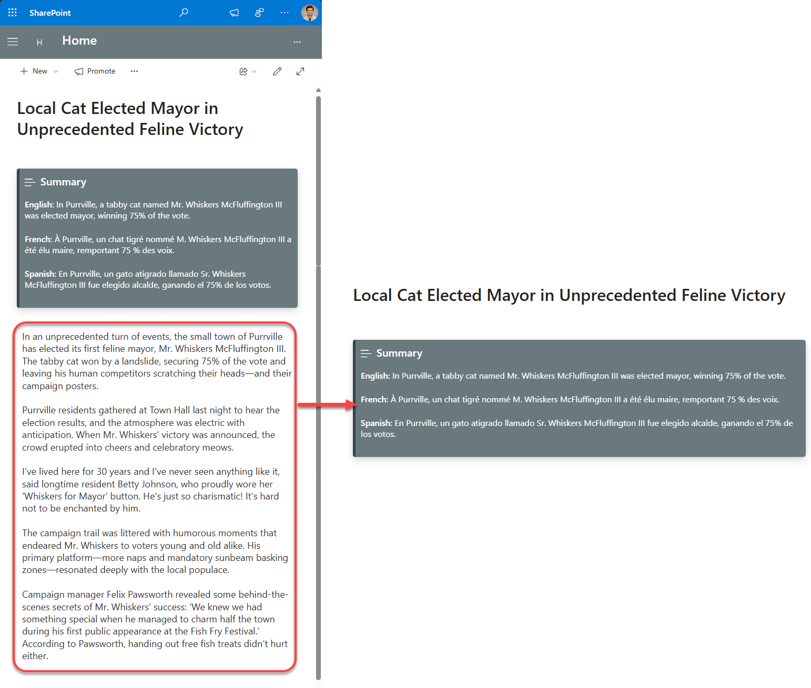

# Multilingual SharePoint Page Summarization with Azure OpenAI API and Microsoft Graph Pages API

## Summary

This sample contains a SharePoint Framework web part and an Azure function that uses the Azure OpenAI API to summarize a SharePoint page in multiple languages. The web part uses the Microsoft Graph Pages API to get the page content and the Azure function uses the Azure OpenAI API to summarize the page content. The web part then displays the summary in the selected language.

## Prerequisites

> Azure OpenAI API key. You can get a key by creating an Azure OpenAI resource in the Azure portal. For more information, see [Create and deploy an Azure OpenAI Service resource](https://learn.microsoft.com/en-us/azure/ai-services/openai/how-to/create-resource?pivots=web-portal).
> See the [Minimal Path to Awesome section](#minimal-path-to-awesome) below for more details related app registration, Azure function and SharePoint site configuration.

## Contributors

- [Anoop Tatti](https://github.com/anoopt)

## Minimal Path to Awesome

- Clone this repository

### App registration

- Register an Azure AD application in your tenant
- Get the client ID
- Replace the `APP_ID` in the `/webpart/src/constants/constants.ts` file with the client ID
- Copy the app name

### Azure Function

- Create an Azure Function App in your tenant with `PowerShell Core` as the runtime stack and version as `7.2`
- Copy the name of the Azure Function App
- Publish the code in `/azure-functions` to the Azure Function App by following the steps in <https://learn.microsoft.com/en-us/azure/azure-functions/functions-run-local?tabs=v4%2Clinux%2Ccsharp%2Cportal%2Cbash#publish>
- Secure the Azure Function App with the app registration created above
  - Go to the Azure Function in the portal and navigate to the "Authentication" configuration blade. Enable authentication and choose "Microsoft" as the "Identity provider". Then, select the app registration created above as the "App registration". Save the configuration.  
- Add the following application settings to the Azure Function App
  | Name | Value             |
  | ------- | ---------------- |
  | API_Endpoint | Your Azure OpenAI deployment endpoint |
  | API_Key | Your Azure OpenAI API key  |
- Get the function URL of the functions in the Azure Function App
  - Go to the Azure Function in the portal and navigate to the "Functions" blade.
  - Click on the function name - Summarise. Copy the "Function URL" from the "Overview" blade.
  - Replace the `AZURE_FUNCTION_SUMMARISE` in the `/webpart/src/constants/constants.ts` file with the function URL
  - Click on the function name - UpdatePage. Copy the "Function URL" from the "Overview" blade.
  - Replace the `AZURE_FUNCTION_UPDATE_PAGE` in the `/webpart/src/constants/constants.ts` file with the function URL
- Enable managed identity for the Azure Function App
  - Go to the Azure Function in the portal and navigate to the "Identity" configuration blade. Enable the "System assigned" managed identity. Save the configuration.
- Grant the Azure Function App access to the SharePoint site
  - Open the Azure Cloud Shell by clicking on the ">_" icon in the Azure portal toolbar in the top right corner.
  - Run the command `m365 login --authType identity` to login to Microsoft 365.
  - Run the command `m365 aad approleassignment add --appDisplayName "<Azure Function App name>" --resource "SharePoint" --scopes "Sites.ReadWrite.All"` to grant the Azure Function App access to SharePoint sites. Replace the `<Azure Function App name>` with the name of the Azure Function App.
  - This permission is required to update the page column and will be used by the `UpdatePage` function.
  - Note: `Sites.Selected` permission cab be used to if needed to restrict the access to the SharePoint site.

### Column in the Site Pages library

- Create a column in the Site Pages library
  - Go to the SharePoint site in the browser where you want to add the web part
  - Navigate to the Site Pages library
  - Create a new column called "Summary" of type "Multiple lines of text"

### SPFx web part

- Edit the `webpart/config/package-solution.json` file and replace the `APP_REG_NAME` with the app registration name created above
- Open command prompt in the `webpart` folder
- in the command line run:
  - `npm install`
  - `gulp build`
  - `gulp bundle --ship`
  - `gulp package-solution --ship`
  - Add and Deploy Package to AppCatalog
- In the API access page approve the following
  - `user_impersonation` permission for the app registration created above
  - `Sites.Read.All` permission for the Microsoft Graph API
- Add the "Summarise" web part to a page in the SharePoint site

### Running the Azure function and web part locally

#### Azure Function

- Make a copy of the `./azure-functions/local.settings.sample.jsonc` file and rename it to `local.settings.json` in the `azure-functions` folder
- Follow the steps mentioned [here](https://pnp.github.io/powershell/cmdlets/Connect-PnPOnline.html#example-6) to create an app registration for connecting with PnP PowerShell 
- Add `TENANT_ID`, `CLIENT_ID`, `PFX_PATH` and `PFX_PASSWORD` to the `local.settings.json` file (based on the app registration created in the previous step)
- Add the `API_Endpoint` and `API_Key` to the `local.settings.json` file (based on the Azure OpenAI API resource)
- Open command prompt in the `azure-function` folder
- in the command line run:
  - `func start`

#### SPFx web part

- Edit the `webpart/config/package-solution.json` file and replace the `APP_REG_NAME` with the app registration name created in the `App registration` step
- Open command prompt in the `webpart` folder
- in the command line run:
  - `npm install`
  - `gulp build`
  - `gulp bundle --ship`
  - `gulp package-solution --ship`
  - Add and Deploy Package to AppCatalog
- In the API access page approve the following
  - `user_impersonation` permission for the app registration created above
  - `Sites.Read.All` permission for the Microsoft Graph API
- Add the "Summarise" web part to a page in the SharePoint site
- Open command prompt in the `webpart` folder
- in the command line run:
  - `gulp serve`

- Open a page in the SharePoint site which has some text content
- Append `?loadSPFX=true&debugManifestsFile=https://localhost:4321/temp/manifests.js` to the URL
- Add the "MultiLingual Summary" web part to the page

## References

- [Getting started with SharePoint Framework](https://learn.microsoft.com/sharepoint/dev/spfx/set-up-your-developer-tenant)
- [Building for Microsoft teams](https://learn.microsoft.com/sharepoint/dev/spfx/build-for-teams-overview)
- [Use Microsoft Graph in your solution](https://learn.microsoft.com/sharepoint/dev/spfx/web-parts/get-started/using-microsoft-graph-apis)
- [Publish SharePoint Framework applications to the Marketplace](https://learn.microsoft.com/sharepoint/dev/spfx/publish-to-marketplace-overview)
- [Microsoft 365 Patterns and Practices](https://aka.ms/m365pnp) - Guidance, tooling, samples and open-source controls for your Microsoft 365 development
- [Fluent UI version 9](https://github.com/microsoft/fluentui/tree/master/packages/react-components) - Converged Fluent UI components

## Disclaimer

**THIS CODE IS PROVIDED *AS IS* WITHOUT WARRANTY OF ANY KIND, EITHER EXPRESS OR IMPLIED, INCLUDING ANY IMPLIED WARRANTIES OF FITNESS FOR A PARTICULAR PURPOSE, MERCHANTABILITY, OR NON-INFRINGEMENT.**